# flashflow manual

flashflow is a local, text-first study tool for recall cards, cloze blanks, quiz questions, and small image-supported review cards. It is built for fast personal bank making: paste a table, import a CSV or XLSX workbook, or create a mixed bank in the builder, then review from the central card without leaving the page.

The app saves banks, card order, ratings, skipped cards, review history, typing settings, timed review settings, minimal mode, and the active bank in browser storage. Export progress JSON before clearing browser data or moving devices.

## Mental model

flashflow has four main ideas:

- **Banks** are study sets. A CSV creates one bank. An XLSX workbook creates one bank per valid worksheet.
- **Cards** are rows inside a bank. One bank can mix regular, cloze, quiz, and image-supported cards.
- **Ratings** describe how well you recalled a card: `again`, `hard`, `good`, or `easy`.
- **The queue** decides what appears next. Timed review can schedule cards by minute delays; filters let you manually review rated groups.

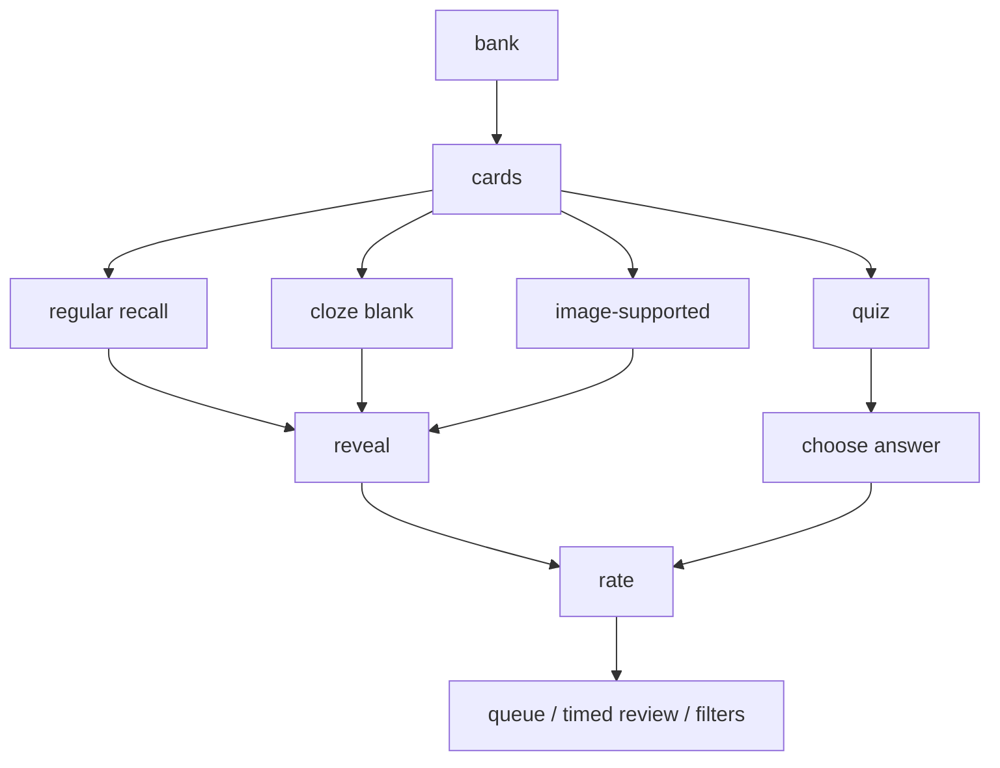

## Quick start

1. Open the manager.
2. Select **load sample** and choose either the CSV sample or XLSX sample.
3. Click the center of the card, or press `Space`, to reveal.
4. Rate your recall with `1 again`, `2 hard`, `3 good`, or `4 easy`.
5. Use **previous** to revisit the last card in the same bank.
6. Use **forward** to move through a rated card without changing its rating.
7. Export **progress json** when you want a full backup.

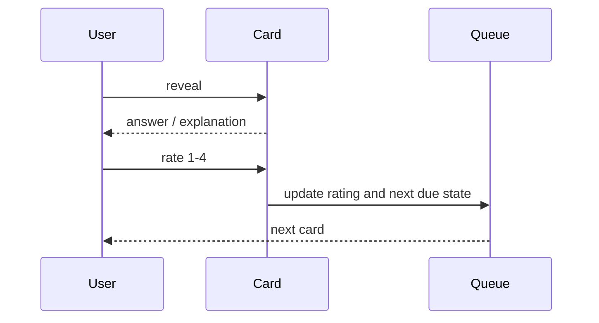

## The study screen

The flashcard is the main surface. On normal cards, the front appears first. The answer appears after reveal. On quiz cards, choices appear inside the card. On image cards, images stay bounded inside the colored face and can be tapped for a large preview.

The lower controls are:

- **shuffle**: reshuffles the active bank queue.
- **previous**: returns to the previous card in the active bank.
- **reveal**: shows the answer, or flips back to the question preview after reveal.
- **skip / forward**: skips an unrated card, or moves forward on a rated card without changing its rating.
- **reset**: resets the active bank progress after confirmation.

Card zones:

- left side: previous.
- center: reveal or flip back preview.
- right side: skip or forward.

Zones ignore controls, quiz choices, images, menus, and modal elements.

## Keyboard controls

| key | action |
| --- | --- |
| `Space` | reveal answer, then flip back to question preview |
| `1` | rate again |
| `2` | rate hard |
| `3` | rate good |
| `4` | rate easy |
| `<` or left arrow | previous |
| `>` or right arrow | skip or forward |
| `ArrowUp` / `ArrowDown` | move quiz keyboard choice |
| `A`, `B`, `C`, etc. | choose matching quiz option |
| `Enter` | submit typing answer, select/toggle quiz choice, or check multi-answer quiz |
| `Escape` | close open menus or modals |

flashflow blurs active controls after shortcut actions so the last clicked button should not trap keyboard input.

## Card types

### Regular cards

Regular cards use a prompt and an answer.

```csv
type,front,back,accepted,explanation,tags
r,what organ filters blood?,kidney,kidney|kidneys,the kidneys filter blood and help regulate fluid balance,physiology
```

Study flow:

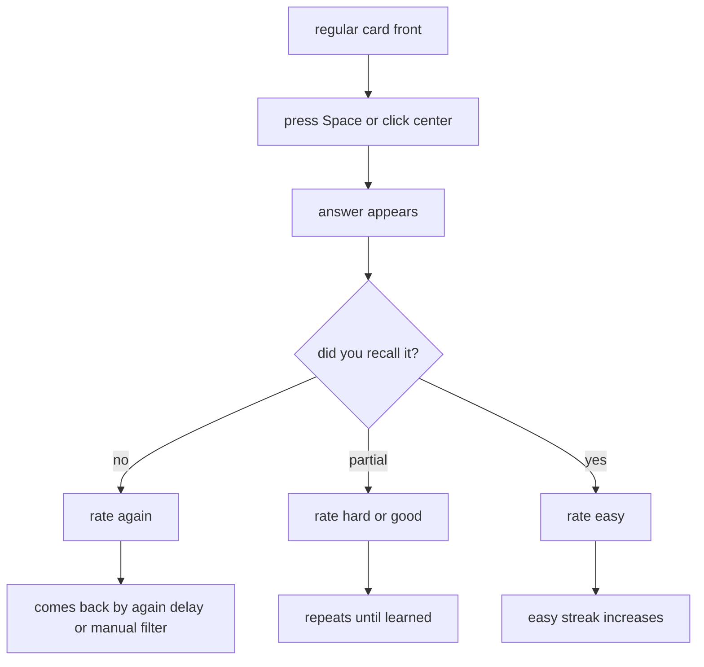

Regular cards support typing mode. Accepted answers can be separated with `|`.

### Cloze cards

Cloze cards hide terms inside a sentence.

```csv
type,text,tags
c,The [[kidney]] filters blood.,physiology
```

Front:

```text
The _____ filters blood.
```

Reveal:

```text
The kidney filters blood.
```

The hidden term is underlined on reveal. Typing mode accepts the cloze term itself and the full revealed sentence.

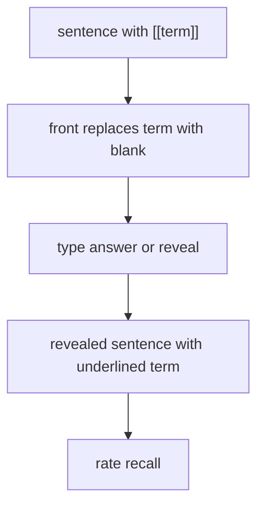

### Quiz cards

Quiz cards use a stem, choices, and an answer key.

```csv
type,stem,A,B,C,D,answer,explanation,tags
q,Which cell produces myelin in the CNS?,astrocyte,oligodendrocyte,schwann cell,microglia,B,Oligodendrocytes myelinate CNS axons,neuro
```

Single-answer quiz cards grade immediately when a choice is selected. Correct answers rate as easy in basic mode. Wrong answers rate as again.

Multi-answer quiz cards allow more than one correct choice:

```csv
type,stem,A,B,C,D,answer,explanation,tags
q,Which are epithelial tissues?,simple squamous,smooth muscle,stratified squamous,cartilage,A|C,Both named choices are epithelial tissue types,histology
```

For multi-answer cards, select all intended choices, then press **check**. The selected set must exactly match all correct answers.

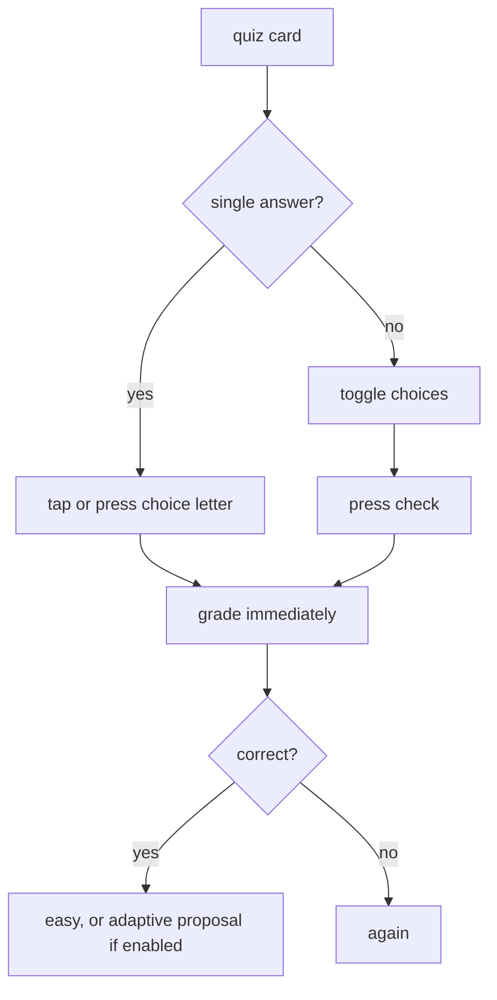

### Image-supported cards

Any card can include images. Put public image links in image fields, or use Markdown image syntax inside text fields.

Recommended fields:

```csv
type,front,back,image,imageBack,explanation,tags
i,identify the tissue,compact bone,https://drive.google.com/file/d/FILE_ID/view?usp=sharing,https://drive.google.com/file/d/FILE_ID_2/view?usp=sharing,look for osteons,histology
```

Supported image fields:

```text
image
imageFront
frontImage
imageBack
answerImage
backImage
imageExplanation
explanationImage
```

Supported inline Markdown:

```markdown

```

Google Drive links are converted internally into bounded card images. Files must be shared publicly as anyone with the link. If a Drive image does not render, the usual cause is private sharing or a blocked file preview.

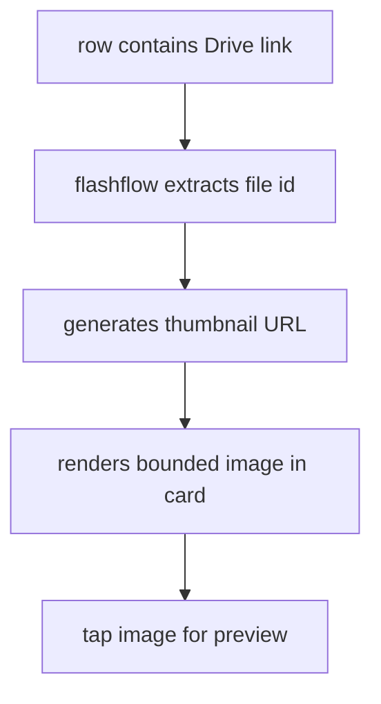

## Ratings and review logic

Ratings are stored on each card.

| rating | meaning | default timed delay |
| --- | --- | --- |
| `again` | missed or wrong | 1 minute |
| `hard` | recalled with difficulty | 5 minutes |
| `good` | mostly recalled | 7 minutes |
| `easy` | confidently recalled | 10 minutes |

When timed review is on, ratings schedule cards with the configured delay. When timed review is off, rated cards remain reviewable through filters.

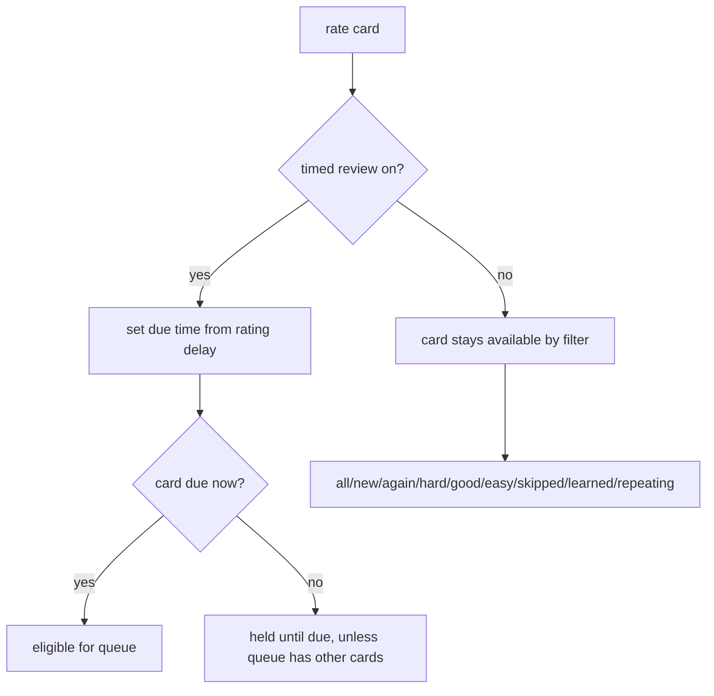

### Learned cards

The **fully learned after** setting controls how many consecutive easy ratings a card needs before it is fully learned. Default: `3`.

- Easy increases the streak.
- Any non-easy rating resets the streak.
- Fully learned cards stop returning in the normal queue.
- Learned cards can still be inspected through filters and exports.

### Repeating cards

Repeating means a card is rated but not fully learned. It includes `again`, `hard`, `good`, and easy cards that have not reached the easy streak threshold.

### Skipped cards

Skip leaves an unrated card unlearned. It is counted separately and can be filtered with `skipped`.

## Previous and forward

**previous** is navigation. It stays inside the active bank and does not change ratings.

**forward** moves away from a rated card without changing the existing rating.

Explicit rating review can reopen the rating buttons with the previous rating highlighted. Natural reappearance from queue cycling, shuffle, filters, or forward does not automatically reopen rating review.

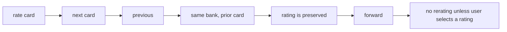

## Typing mode

Typing mode applies to regular and cloze cards, not quiz cards.

Flow:

1. Enable typing mode in settings.
2. Type an answer into the field.
3. Press `Enter`.
4. flashflow reveals the answer and compares your input.
5. If auto-rating proposal is on, flashflow proposes a rating.
6. You can accept or override the rating with `1`, `2`, `3`, or `4`.

For cloze cards, flashflow accepts:

- the hidden term,
- any accepted answer field,
- the full revealed cloze sentence.

## Adaptive quiz mode

Basic quiz mode has only two automatic outcomes:

- correct: easy.
- wrong: again.

Adaptive quiz mode can propose `again`, `hard`, `good`, or `easy` for correct quiz answers based on answer speed. Longer stems and choices allow more time. The proposal is editable with rating keys.

## Imports

flashflow accepts:

- CSV files.
- XLSX files.
- pasted CSV.
- pasted TSV or copied spreadsheet rows.
- pasted Markdown pipe tables.
- the built-in builder table.

### Mixed bank header

Use this wide header when you want one table that can contain every card type:

```csv
type,front,back,text,stem,A,B,C,D,E,answer,accepted,explanation,tags,image,imageBack
```

`type` is optional. If provided, these compact values are recommended:

| type | card |
| --- | --- |
| `r` or `regular` | regular card |
| `c` or `cloze` | cloze card |
| `q` or `quiz` | quiz card |
| `i` or `image` | image-supported regular card |

Rows are parsed independently. A single sheet can contain regular rows, cloze rows, quiz rows, and image rows together.

### Auto-detection

If `type` is blank:

- rows with `stem`, choice columns, and `answer` become quiz cards.
- rows with `text` containing `[[...]]` become cloze cards.
- rows with `front/back`, `q/a`, or compatible fields become regular cards.
- rows with image fields become image-supported cards.

### XLSX workbooks

Each valid worksheet becomes one bank. Invalid or empty sheets are skipped. This makes topic workbooks convenient: one workbook can create many banks at once.

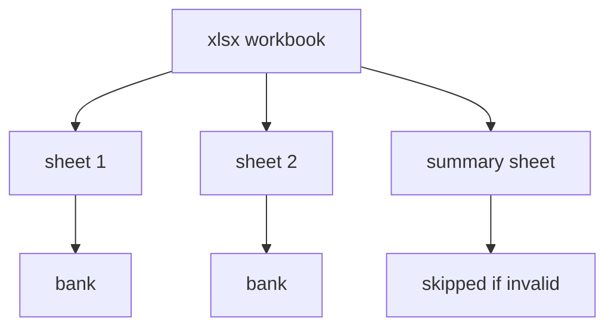

### Paste import

Paste import accepts copied spreadsheet cells, TSV, CSV, and Markdown tables. Markdown pipe tables should include a header row.

```markdown
| type | front | back | tags |
| --- | --- | --- | --- |
| r | what is the renal filtration organ? | kidney | physiology |
```

## The manager

The manager is compact by default. Advanced mode reveals heavier controls.

Compact manager:

- bank selector.
- select banks.
- create bank.
- import csv/xlsx.
- load sample.
- settings panels.
- search/filter cards.
- select cards.
- export and restore.

Advanced manager:

- rename/delete current bank.
- paste csv/table.
- add/edit cards.

Bulk actions use ellipsis menus to reduce clutter. Selection mode stays visible because it changes the list behavior.

## Create bank builder

The builder is a spreadsheet-style modal for quick mixed banks.

Recommended row type keys:

- `r`: regular.
- `c`: cloze.
- `q`: quiz.
- `i`: image-supported regular card.

Builder columns:

- `type`: compact row type.
- `front / text / stem`: regular front, cloze sentence, or quiz stem.
- `back`: regular answer or cloze supporting back text.
- `choices`: one quiz choice per line.
- `answer`: typed answer, accepted answer, or quiz key like `A` or `A|C`.
- `tags`: searchable grouping text.
- `explanation`: short note shown after reveal or grading.
- `images`: front image and answer image links.

The builder saves through the same parser as imports, so it follows the same card rules.

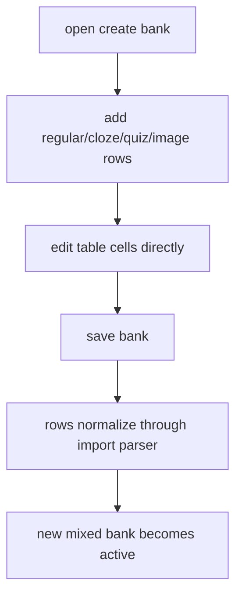

## Samples

The CSV sample is a small quick-start deck.

The XLSX sample is a larger workbook with multiple sheets demonstrating:

- start here.
- regular cards.
- cloze typing.
- single-answer quiz.
- multi-answer quiz.
- Google Drive images.
- mixed bank layout.
- keyboard and touch behavior.
- bank builder.
- review steps.
- use cases.

Use **load sample** and choose CSV or XLSX. If sample loading fails from `file://`, run the toolbox through a local server or import the sample file manually.

## Example flows

### Lecture recall

Use this when you have notes from a lecture and want active recall.

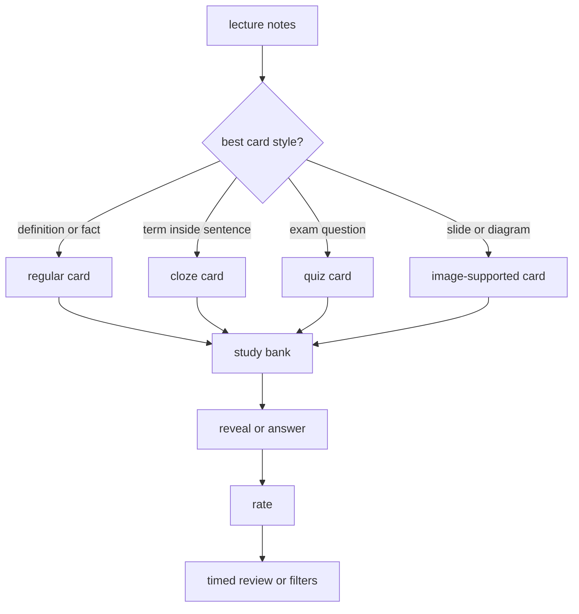

Detailed example:

1. Put the lecture topic in `tags`.
2. Use regular cards for direct recall.
3. Use cloze cards for exact wording or pathways.
4. Use quiz rows for exam-style practice.
5. Use image fields for slides.
6. Study normally.
7. Filter `again` and `hard` before the exam.
8. Export progress JSON after a long session.

### Regular card review

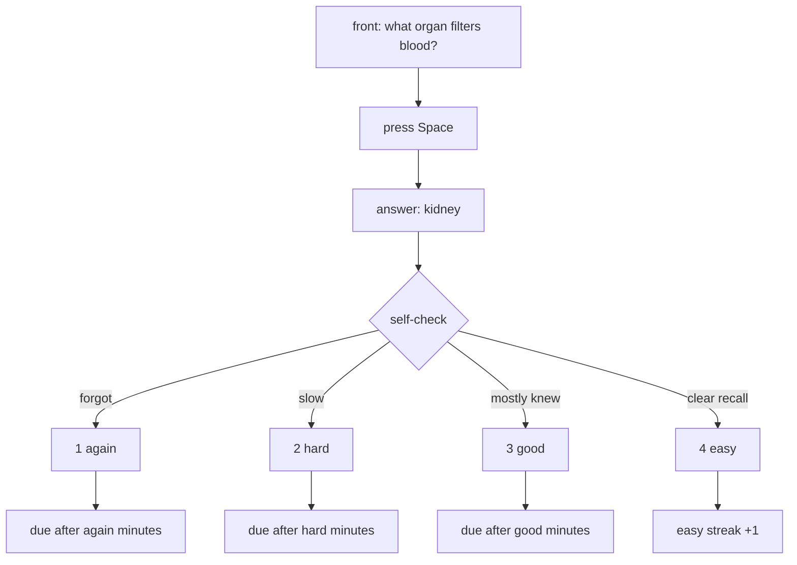

### Cloze memorization

Use cloze cards when you need to remember a missing word in context.

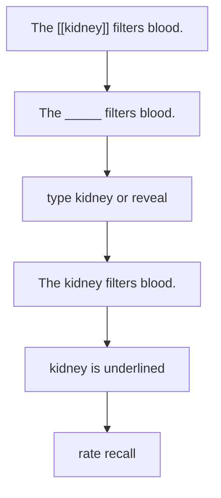

### MCQ practice

Use quiz cards when the task is choosing between options.

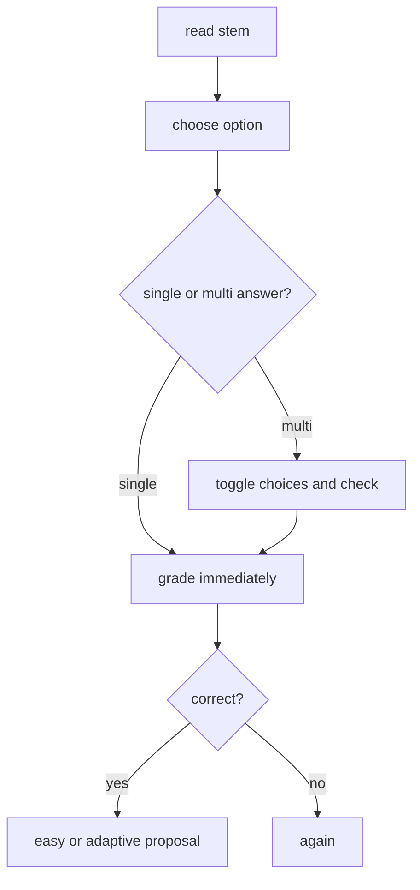

### Histology or slide review

Use image-supported cards when the visual is the prompt or answer.

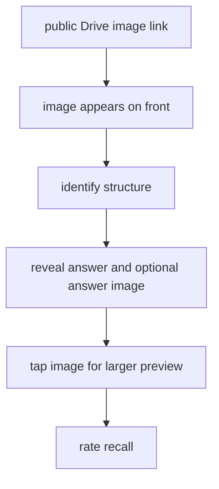

### Mixed exam bank

Use a mixed bank when one topic needs several recall styles.

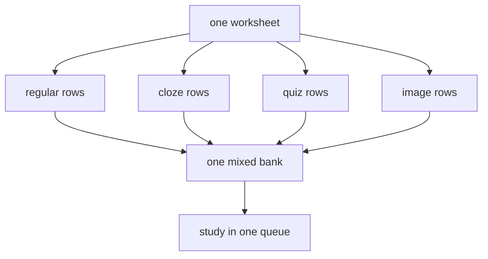

## Export and restore

Use **cards csv** when you want the active bank content.

Use **progress json** when you want everything needed to restore your study state:

- banks.
- cards.
- active bank.
- queue.
- current card.
- ratings.
- skipped state.
- typing settings.
- timed review settings.
- minimal mode.
- review history.
- status counts.

Restore progress JSON only from files you trust.

## AI prompt for making banks

```text
Create a FlashFlow-compatible mixed study bank as a CSV table. Use this header: type,front,back,text,stem,A,B,C,D,E,answer,accepted,explanation,tags,image,imageBack. Include regular cards, cloze cards using [[answer]], single-answer quiz rows, multi-answer quiz rows using A|C syntax, tags, accepted answers, concise explanations, and optional public Google Drive image links. Keep explanations short and do not repeat the answer exactly.
```

## Troubleshooting

### Keyboard shortcuts do nothing

Close any open modal or menu, then click the card once. Shortcuts are ignored while typing in ordinary inputs, except rating after typing reveal.

### Quiz letters do not match choices

Choice columns must start at `A` and continue without gaps. If using exact choice text as the answer, make sure it matches the choice text.

### Multi-answer quiz grades wrong

The selected set must exactly match the correct set. `A|C`, `A, C`, and `1|3` are accepted answer styles.

### Image does not show

Make the Drive file public to anyone with the link. Some school or organization Drive policies can still block embeds.

### Explanation disappears

flashflow hides the explanation when it duplicates the answer exactly. This prevents redundant answer/explanation lines.

### A card is not returning

Check whether timed review is on, whether the card is fully learned, and whether a filter is active. Learned cards stop appearing in the normal queue.

### You want to review only a rating group

Use the card filter: `again`, `hard`, `good`, `easy`, `skipped`, `learned`, or `repeating`.

### You are moving devices or clearing browser data

Export progress JSON first, then restore it later.
